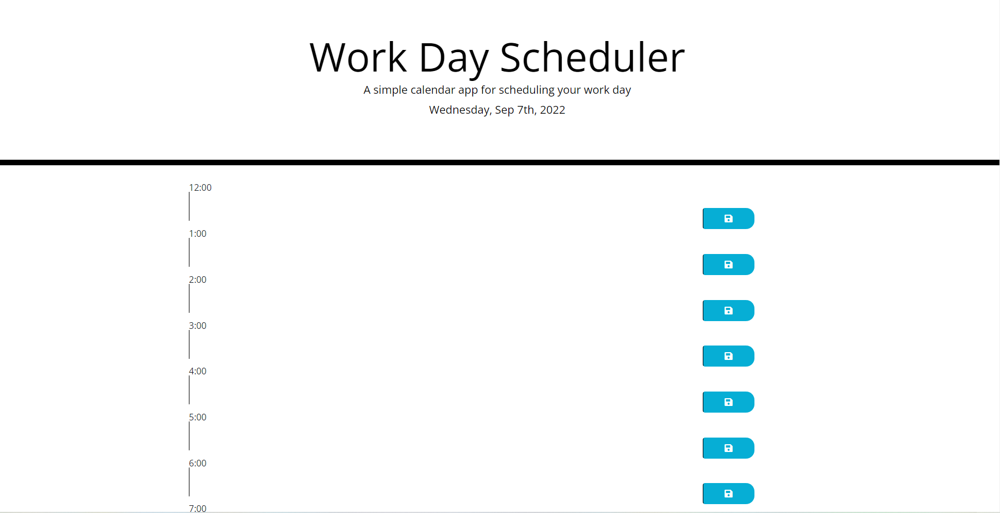

# WorkDaySkeddy

## Description

Provide a short description explaining the what, why, and how of your project. Use the following questions as a guide:

My motivation was to create an app that can help me better organize my days during work. I built this app to expand the depths of my understanding of javascript. The problem this app solves is forgetfulness as well as over scheduling.
i learned how to create a local storage to store basic data. 

## Usage

PThe only page of this app displays the current date, time blocks, text area, and a save button for you to organize your day. 

## License

The last section of a high-quality README file is the license. This lets other developers know what they can and cannot do with your project. If you need help choosing a license, refer to [https://choosealicense.com/](https://choosealicense.com/).

---

🏆 The previous sections are the bare minimum, and your project will ultimately determine the content of this document. You might also want to consider adding the following sections.

